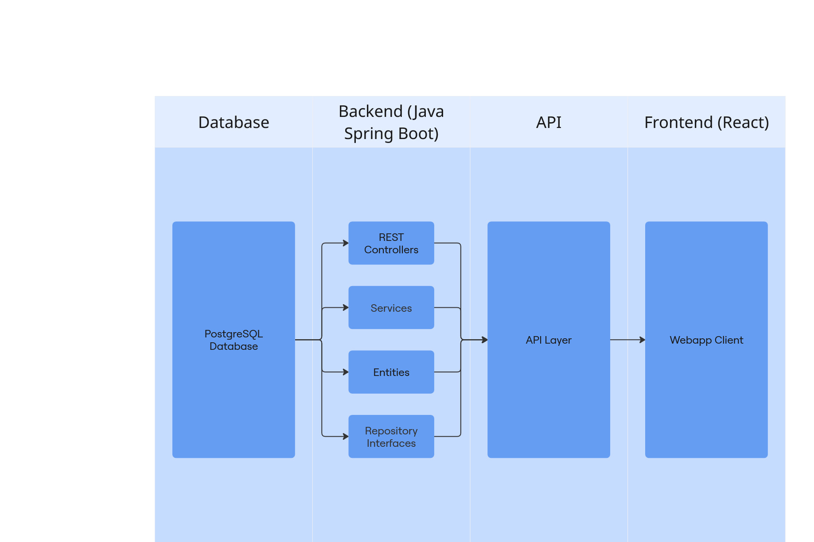
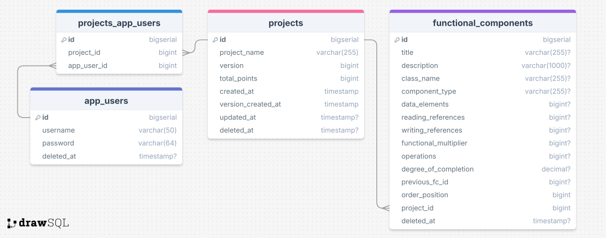
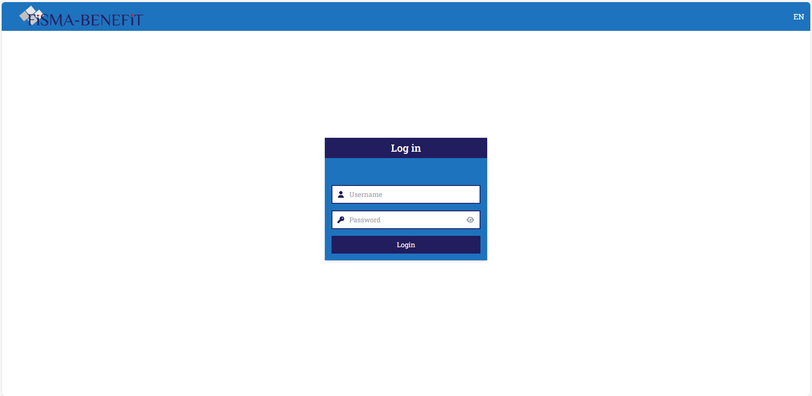
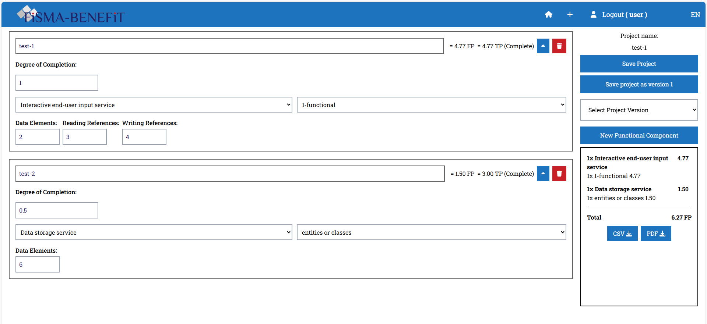

<a id="readme-top"></a>

<!-- BANNER SHIELDS -->

[![Contributors][contributors-shield]][contributors-url]
[![Last commit][commit-shield]][commit-url]
[![Issues][issues-shield]][issues-url]
[![MIT License][license-shield]][license-url]

<!-- TITLE -->

<br />
<div align="center">
  <a href="https://www.fisma.fi/in-english/">
    
  </a>
  <a href="https://www.haaga-helia.fi/en">
    
  </a>

  <h3 align="center">Benefit application</h3>

  <p align="center">
    All in one repository for the Benefit application developed in collaboration
    <br /> between FiSMA ry and Haaga-Helia University of Applied Sciences.
    <br />
    <a href="#getting-started"><strong>Installation and development »</strong></a>
  </p>
</div>

<!-- TABLE OF CONTENTS -->

<br>
<details>
<summary><b>Table of Contents</b></summary>
  <ol>
    <li>
        <a href="#about-the-project">About the Project</a>
    </li>
    <li>
        <a href="#deployment">Deployment</a>
    </li>
    <li>
        <a href="#fisma-11-method-overview">FiSMA Method Overview</a>
    </li>
    <li>
        <a href="#built-with">Built With</a>
    </li>   
    <li>
        <a href="#getting-started">Getting Started</a>
    </li>
    <li>
        <a href="#usage">Usage</a>
    </li>
    <li>
        <a href="#cicd">CI/CD</a>
    </li>
    <li>
        <a href="#quality-assurance-and-security">Quality Assurance and Security</a>
    </li>
    <li>
        <a href="#roadmap">Roadmap</a>
    </li>
    <li>
        <a href="#contributing">Contributing</a>
    </li>
    <li>
        <a href="#license">License</a>
    </li>
    <li>
        <a href="#contact">Contact</a>
    </li>
  </ol>
</details><br>

<!-- ABOUT THE PROJECT -->

## About the Project

The Benefit application has been developed in collaboration with FiSMA ry and Haaga-Helia University of Applied Sciences. It's designed for function point analysis (see [method overview](#fisma-11-method-overview)), primarily supporting Scope Managers in performing calculations, reporting, and archiving. The main functionality of the app follows standard ISO/IEC 29881.

### What is Function Point Analysis?

Function point analysis is used to measure the functional size of software. This measurement can then be applied when analyzing productivity or preparing workload estimates.

There are several function point analysis methods, but in this project, the term specifically refers to the FiSMA 1.1 method.

<p align="right">(<a href="#readme-top">back to top</a>)</p>

<!-- DEPLOYMENT -->

## Deployment

You can check Benefit out yourself at https://fisma-benefit-app.github.io/benefit-app/#/login. The backend has been deployed using Heroku and the frontend using GitHub Pages. More information can be found in the [deployment guide](/documents/guides/deployment_guide.md).

### Architecture

<details>
<summary><b>Click here to view the software architecture</b></summary>

</details>

<details>
<summary><b>Click here to view the database diagram</b></summary>

</details><br>

More information on how to access the database can found in the [database guide](/documents/guides/database.md).

### API

Benefit's API documentation has been created using SpringDoc and Widdershins. It can be viewed [here](/documents/references/api.md) and can be refreshed by following the steps specified in the [API guide](/documents/guides/how_to_generate_api_docs.md).

<p align="right">(<a href="#readme-top">back to top</a>)</p>

### Logging

Logging in the Benefit app covers both runtime and build/test events:

- **Backend**: Spring Boot’s default logging plus Spring Security logs (configurable in `application.yaml`).
  - Tests: Gradle test results with detailed exceptions and stack traces (configured in `build.gradle`).
- **Frontend**:
  - Build logs: terminal (local) or GitHub Actions (Heroku).
  - Runtime logs: browser DevTools console.

Logs are written to the terminal during local development and can be streamed in production with the Heroku CLI. For full details, see the [logging guide](/documents/guides/logging.md).

### Cache

Benefit uses several caches to improve performance and speed up builds:

- **Vite cache**: Speeds up frontend development by pre-bundling dependencies.
- **Heroku build cache**: Persists backend build artifacts between deploys for faster CI/CD.
- **Gradle cache**: Can be enabled for backend build optimization (disabled by default).
- **App-specific memoization cache**: The frontend caches functional point calculations in [`centralizedCalculations.ts`](frontend/src/lib/centralizedCalculations.ts) using component-specific keys. This ensures recalculation only happens when component data changes. You can monitor or clear this cache using `getCacheSize()` and `clearCalculationCache()`.

For details and cache clearing instructions, see the [Caching Guide](/documents/guides/caching.md).

<p align="right">(<a href="#readme-top">back to top</a>)</p>

<!-- FISMA 1.1 METHOD OVERVIEW -->

## FiSMA 1.1 Method Overview

In FiSMA 1.1, each user-relevant function is classified into a function category and function type, and entered as a row in a table. Each function is assigned:

- A unique identifier
- Required measurable attributes, including:
  - Data elements
  - Read references
  - Write references
  - Operations
  - Function factor

Examples of functions:

- A list view on a web page
- A CSV report
- An integration
- A database table

Not considered functions:

- Technical features (e.g. internal logging, developer utilities)
- Quality-related features (e.g. caching)

These are excluded because they do not directly provide new functionality to the user. Functional size is measured strictly through functional requirements or working software features.

### northernSCOPE™ Concept

The [northernSCOPE™](https://www.fisma.fi/wp-content/uploads/2022/01/northernscope-brochure-v152.pdf) concept is a framework developed and provided by FiSMA to support the application of function point analysis in software projects.

<p align="right">(<a href="#readme-top">back to top</a>)</p>

<!-- BUILT WITH -->

## Built With

This project is built with:

![Back-end][back-end-shield]<br>
[![Java][java-shield]][java-url]
[![Spring Boot][spring-shield]][spring-url]
[![Gradle][gradle-shield]][gradle-url]

![Front-end][front-end-shield]<br>
[![TypeScript][typescript-shield]][typescript-url]
[![React][react-shield]][react-url]

![Database][database-shield]<br>
[![PostgreSQL][postgres-shield]][postgres-url]

![Tools][tools-shield]<br>
[![Docker][docker-shield]][docker-url]
[![Figma][figma-shield]][figma-url]
[![GitHub][github-shield]][github-url]
[![GitHub Actions][github-actions-shield]][github-actions-url]
[![Visual Studio Code][vs-code-shield]][vs-code-url]

<p align="right">(<a href="#readme-top">back to top</a>)</p>

<!-- GETTING STARTED -->

## Getting Started

This guide explains how to set up the Benefit App locally for development.

### 1) Prerequisites

- **Docker Desktop 4.39.0 or newer** installed (and running).
- Or, for local-only dev (without Dockerized backend):
  - a local **PostgreSQL** installation (or use only the dockerized database - see 3B)
  - **Java 21**
  - **Nodejs** and **npm** (latest LTS recommended)
  - (Optional) **Git** and a code editor (e.g. VS Code ≥ 1.98.2)

Check Java version:

```bash
java --version
echo $JAVA_HOME # or echo %JAVA_HOME% on Windows
```

If `JAVA_HOME` is unset or points to the wrong directory, Gradle builds may fail.

### 2) Setup

```bash
# clone
git clone <your-repo-url>
cd benefit-app

# root env
cp .env.example .env

# frontend env
cp frontend/.env.example frontend/.env
```

| You can change them as you wish, but the dev environment should usually work with the default values.

### 3) Run Options

#### A) Full Dockerized Setup

```bash
# start (build on first run or when Dockerfiles change)
docker compose up --build

# stop (keep DB data and caches)
docker compose down

# stop and reset EVERYTHING (DB, caches, volumes)
docker compose down -v
```

Open:

- Frontend: http://localhost:5173/benefit-app/login
- Backend: http://localhost:8080/actuator/health

#### B) Development Without Docker (local backend)

1. You only need the `frontend/.env` file with VITE_API_URL pointing to your backend (`http://localhost:8080` by default).
2. If you have previously run Docker, clean backend build dirs once to avoid permission issues:
   ```bash
   sudo rm -rf backend/.gradle backend/build
   ```
3. Make sure a Postgres DB is available:
   - Run only Postgres via Docker:
     ```bash
     docker compose up db
     ```
   - Test DB connection:
     ```bash
     docker exec -it fisma_db psql -U POSTGRES_USER POSTGRES_DB
     ```
   - Or use your own Postgres locally (check port/credentials in `backend/src/main/resources/application.yaml`).
4. Start backend:

   ```bash
   cd backend
   ./gradlew bootRun
   ```

   Or build and run packaged jar:

   ```bash
   ./gradlew build
   java -jar build/libs/backend-0.0.1-SNAPSHOT.jar
   ```

5. Start frontend:

   ```bash
   cd frontend
   npm install
   npm run dev
   ```

   By default, the app runs at `http://localhost:5173`.

### 4) Other steps

IMPORTANT! If you continue on developing this app, it is important to keep consistent formatting in your changes. Benefit app has a `pre-commit` Git hook to run all necessary formattings on each commit. To take advantage of this, run this command in your terminal:

```sh
git config core.hooksPath .githooks
```

This command tells Git to look for the `pre-commit` hook from the `.githooks` folder.

### (Optional) Troubleshooting

- **No seed users** → ensure backend has `spring.sql.init.mode=always` in `application.yaml` or `SPRING_SQL_INIT_MODE=always` in Docker Compose, then reset DB once.
- **Hot reload flaky in Docker** → keep `CHOKIDAR_USEPOLLING=true`.
- **Java not detected / build fails** → Ensure `JAVA_HOME` points to your JDK 21 installation. Example (PowerShell):

  ```powershell
  $javaPath = Split-Path -Path (Split-Path -Path (Get-Command java).Source -Parent) -Parent
  setx /m JAVA_HOME $javaPath
  ```

- **Backend build errors** → Run `./gradlew clean build` and verify that `build.gradle` uses:

  ```gradle
  java {
    toolchain {
        languageVersion = JavaLanguageVersion.of(21)
    }
  }
  ```

- **Database connection issues** → Double-check Docker is running, and test with `psql` as shown above. If using local Postgres, ensure the port and credentials match `application.yaml`.
- **Switching between Docker/local backend** → Always clean `backend/.gradle` and `backend/build` before switching.
- **Login fails with** `Error getting JWT ... Status: 404` or **Error fetching projects / JSON parse errors** → `VITE_API_URL` is likely misconfigured. Ensure it matches your backend’s URL.
- `npm install` **fails (permissions)** → Remove the node_modules folder and try again:

  ```bash
  rm -rf node_modules
  npm install
  ```

### (Optional) Notes

- Change host ports in `.env` if 5173/8080/5433 are taken.
- Use a DB GUI (e.g., DBeaver) with host `localhost`, port `5433`, db `fisma_db`, user `myuser`, pass `secret`.

<p align="right">(<a href="#readme-top">back to top</a>)</p>

<!-- USAGE -->

## Usage

### Login

- Login with username and password.
<details>
<summary><b>Click here to view an image of the login page</b></summary>

</details><br>

### Main View

- Create, save, and export (CSV, PDF) projects.
<details>
<summary><b>Click here to view an image of the front page</b></summary>

</details><br>

### Demos

Below are two demos of the app recorded on May 14 2025.

#### Part 1

- Login, create new project, calculate functional points, and view version control.

[Click here to see demo part 1](https://github.com/user-attachments/assets/1407d6b8-f1fe-47c1-9fae-3c74588a6606)

#### Part 2

- Export project, change language, delete project, and attempt login with faulty credentials.

[Click here to see demo part 2](https://github.com/user-attachments/assets/31b00e69-c9dc-461e-97cc-5a5dc96b96ba)

#### Troubleshooting

Both videos can be downloaded and watched [here](/documents/demo/).

<p align="right">(<a href="#readme-top">back to top</a>)</p>

<!-- CI/CD -->

## CI/CD

Benefit application's CI/CD pipeline includes a branching strategy and automated checks through GitHub actions.

### Branching Strategy

Developing the Benefit application is done using trunk-based development. Benefit application's branching strategy is currently following these guidelines:

- `main` branch: production and testing branch

All commits are merged to `main` via pull requests. These PRs go through automatic testing and when they are merged, they trigger automatic deployment to testing environment. See [deployment](#deployment) for more information.

For full explanation of the branching strategy, see [branching strategy](./documents/guides/branching_strategy.md).

### Code Quality and Collaboration

Developer team minimizes errors and maintains good code quality by

- merging all changes only through pull requests
- merging only quality code (ie. pull requests passes all checks in GitHub Actions)
- merging changes only after another team member has given the pull request a peer review and an approval
- resolving all possible conversations, comments and/or change requests in GitHub.

### GitHub Actions

The Benefit application's GitHub repository features a GitHub Actions workflow which runs automated checks and tests on every pull request. Only those pull requests that pass all checks are allowed to merge. These checks are

- formatting checks for frontend (Prettier) and backend (Spotless / Google Java Format)
- backend unit tests

Our automated deployments also utilize GitHub Actions workflows to deploy any merges to `main` to testing environment. See [deployment](#deployment) for more information.

### Code Quality and Collaboration

To minimize errors and maintain quality:

- All changes were merged via pull requests
- Every pull request required peer review and approval from another team member

<p align="right">(<a href="#readme-top">back to top</a>)</p>

<!-- QUALITY ASSURANCE AND SECURITY -->

## Quality Assurance and Security

### Unit Tests

Benefit is covered by unit tests in the backend using JUnit and Mockito. These are configured in the `gradle.build` file. All tests can be run from the `backend/` folder using the command:

```bash
./gradlew test
```

or, if you want to run a specific test class:

```bash
./gradlew test --tests fi.fisma.backend.YourTestClass
```

### Authentication and Authorization

Basic authentication is used. After successful authentication, a JWT is generated and returned. A more detailed authentication guide can be found [here](documents/guides/authentication.md). Authenticated users are authorized with the role ROLE_USER.

<!-- ROADMAP -->

## Roadmap

- [ ] Multilayer architecture
- [ ] Improve error management
- [ ] Improve quality assurance
- [ ] Improve project listing
  - [ ] Implement search functionality
  - [ ] Improve edit functionality
  - [ ] Improve project sorting
- [ ] Update documentation
  - [ ] Document how Benefit handles login tokens (database to API, and vice versa) in user_authentication_guide.md
  - [ ] Document information security on JWTs and cookies
- [ ] Compatibility with mobile

The project's requirement specification can be found [here](https://docs.google.com/document/d/1FXYXPMAwyoZNdxBxYVOIQPrcBr01fXAB4nvHD-Diy7w/edit?tab=t.0#heading=h.6dj02y3xjnh0). See the [open issues](https://github.com/fisma-benefit-app/benefit-app/issues) for a full list of proposed features and known issues.

  <p align="right">(<a href="#readme-top">back to top</a>)</p>

<!-- CONTRIBUTING -->

## Contributing

If you have a suggestion to improve this project:

1. Fork the project
2. Set up the development environment ([see Getting Started](#getting-started))
3. Create your feature branch and set up remotes

   ```bash
   # Clone your fork
   git clone https://github.com/your-username/benefit-app.git
   cd benefit-app

   # Add upstream remote
   git remote add upstream https://github.com/fisma-benefit-app/benefit-app.git

   # Create feature branch
   git checkout -b feature/amazing-feature
   ```

4. Make your changes
   - Follow our coding standards
   - Add tests if applicable
   - Update documentation as needed
5. Run formatting and tests

   ```bash
   # Frontend
   cd frontend
   npx prettier . --write

   # Backend
   cd backend
   ./gradlew spotlessApply
   ./gradlew test
   ```

6. Sync with upstream before committing
   ```bash
   git fetch upstream
   git rebase upstream/main
   ```
7. Commit your changes (`git commit -m 'Add some AmazingFeature'`)
8. Push to the branch (`git push origin feature/AmazingFeature`)
9. Open a pull request

Any contributions you make are greatly appreciated. Thanks again!

<p align="right">(<a href="#readme-top">back to top</a>)</p>

<!-- LICENSE -->

## License

Distributed under the MIT License. See [LICENSE](https://github.com/fisma-benefit-app/benefit-app/blob/HEAD/LICENSE) for more information.

  <p align="right">(<a href="#readme-top">back to top</a>)</p>

<!-- CONTACT -->

## Contact

Representative supervisor: Heikki Naski, FiSMA ry

Project Link: [https://github.com/fisma-benefit-app/benefit-app](https://github.com/fisma-benefit-app/benefit-app)

<p align="right">(<a href="#readme-top">back to top</a>)</p>

<!-- BANNER LINKS -->

[contributors-shield]: https://img.shields.io/github/contributors/fisma-benefit-app/benefit-app.svg?style=for-the-badge
[contributors-url]: https://github.com/fisma-benefit-app/benefit-app/graphs/contributors
[commit-shield]: https://img.shields.io/github/last-commit/fisma-benefit-app/benefit-app.svg?style=for-the-badge
[commit-url]: https://github.com/fisma-benefit-app/benefit-app/commits/main/
[issues-shield]: https://img.shields.io/github/issues/fisma-benefit-app/benefit-app.svg?style=for-the-badge
[issues-url]: https://github.com/fisma-benefit-app/benefit-app/issues
[license-shield]: https://img.shields.io/github/license/fisma-benefit-app/benefit-app.svg?style=for-the-badge
[license-url]: https://github.com/fisma-benefit-app/benefit-app/blob/HEAD/LICENSE

<!-- BUILT WITH LINKS -->

[front-end-shield]: https://img.shields.io/badge/FrontEnd-000000?style=for-the-badge
[back-end-shield]: https://img.shields.io/badge/BackEnd-000000?style=for-the-badge
[database-shield]: https://img.shields.io/badge/Database-000000?style=for-the-badge
[tools-shield]: https://img.shields.io/badge/Tools-000000?style=for-the-badge
[docker-shield]: https://img.shields.io/badge/docker-257bd6?style=for-the-badge&shield=docker&shieldColor=white
[docker-url]: https://www.docker.com/
[figma-shield]: https://img.shields.io/badge/figma-%23F24E1E.svg?style=for-the-badge&shield=figma&shieldColor=white
[figma-url]: https://www.figma.com/
[github-shield]: https://img.shields.io/badge/GitHub-%23121011.svg?shield=github&shieldColor=white&style=for-the-badge
[github-url]: https://github.com/
[github-actions-shield]: https://img.shields.io/badge/github%20actions-%232671E5.svg?style=for-the-badge&shield=githubactions&shieldColor=white
[github-actions-url]: https://github.com/features/actions
[gradle-shield]: https://img.shields.io/badge/Gradle-02303A?style=for-the-badge&shield=Gradle&shieldColor=white
[gradle-url]: https://gradle.org/
[java-shield]: https://img.shields.io/badge/java-%23ED8B00.svg?style=for-the-badge&shield=openjdk&shieldColor=white
[java-url]: https://www.java.com/en/
[postgres-shield]: https://img.shields.io/badge/postgresql-4169e1?style=for-the-badge&shield=postgresql&shieldColor=white
[postgres-url]: https://www.postgresql.org/
[react-shield]: https://img.shields.io/badge/react-%2320232a.svg?style=for-the-badge&shield=react&shieldColor=%2361DAFB
[react-url]: https://react.dev/
[spring-shield]: https://img.shields.io/badge/Spring%20Boot-6DB33F?style=for-the-badge&shield=springboot&shieldColor=white
[spring-url]: https://spring.io/
[typescript-shield]: https://img.shields.io/badge/TypeScript-3178C6?style=for-the-badge&shield=typescript&shieldColor=white
[typescript-url]: https://www.typescriptlang.org/
[vs-code-shield]: https://custom-icon-badges.demolab.com/badge/Visual%20Studio%20Code-0078d7.svg?shield=vsc&shieldColor=white&style=for-the-badge
[vs-code-url]: https://code.visualstudio.com/
