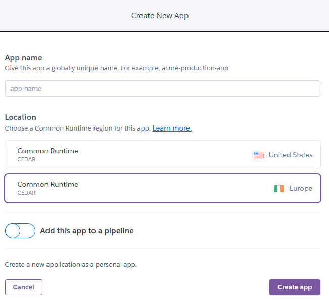
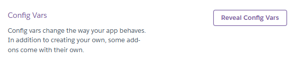
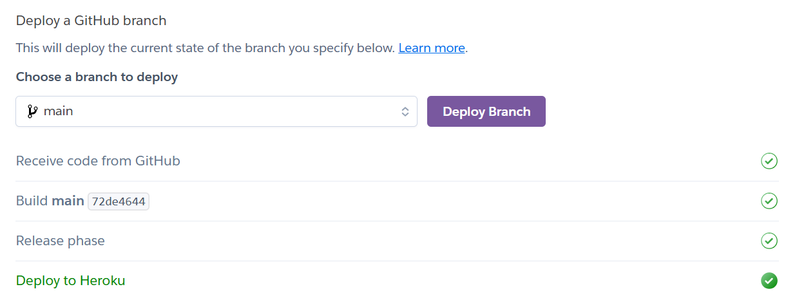

# Deployment Setup

This document explains how the backend and frontend deployments are configured. It covers Heroku setup for the backend and GitHub Pages setup for the frontend, as well as decisions such as the private credentials repository and enforcing Java 21.

For a step-by-step guide on how to deploy backend and frontend, see the [Deployment Guide](../guides/deployment_guide.md).

## Backend: Heroku Deployment

- Heroku app dashboard: https://dashboard.heroku.com/apps/fisma-benefit-app
- Backend URLs look like this: `https://fisma-benefit-app-XXXXXXXXXX.herokuapp.com/`

Logs can be tailed with:

```sh
heroku logs --tail --app fisma-benefit-app
```

### How the Heroku App Was Created

1. Navigate to Heroku dashboard → New → Create new app
   - Enter app name (fisma-benefit-app)
   - Select region (Europe)
   - Click Create app



2. Configure Settings → Config Vars
   - Click Reveal Config Vars
   - Add database credentials as key-value pairs




3. Configure Deploy → GitHub Repository
   - Select GitHub as the deployment method
   - Connect repo loota/fisma-backend-alt
   - Select branch and click Deploy Branch


4. After pushing updates to GitHub, deploy manually from Heroku.



### Why We Have a Separate `backend-credentials` Repo

Heroku requires environment variables such as database `URL`, `USERNAME`, and `PASSWORD`.

- These values must not be stored in the main repository.
- Instead, we maintain a private `backend-credentials` repository that holds sensitive configuration (env files, credential management notes, etc.).
- This separation ensures the public/main repositories remain safe to share while sensitive values are kept private and only injected into deployment environments.

### Enforcing Java 21 in build.gradle

To ensure consistent Java versioning across developer machines and Heroku’s build system, the `build.gradle` file enforces Java 21 with a toolchain:

```gradle
java {
    toolchain {
        languageVersion = JavaLanguageVersion.of(21)
    }
}
```

This guarantees that all builds use Java 21 regardless of local JDK version.

## Frontend: GitHub Pages Deployment

- GitHub Pages dashboard: https://github.com/fisma-benefit-app/benefit-app/settings/pages
- Build logs: https://github.com/fisma-benefit-app/benefit-app/actions (look for "pages build and deployment")

### How GitHub Pages is Configured

1. `vite.config.js`

```js
export default defineConfig({
  base: "/benefit-app/",
  plugins: [react(), tailwindcss()],
});
```

- The `base` property is critical: it must be set to the repository name so GitHub Pages serves files correctly under `/benefit-app/`.

2. `package.json`

We use the `gh-pages` npm package to deploy builds.

```json
"devDependencies": {
  "gh-pages": "^6.3.0"
},
"scripts": {
  "predeploy": "npm run build",
  "deploy": "gh-pages -d dist"
}
```

- predeploy → Builds into dist/
- deploy → Publishes dist/ to the gh-pages branch
