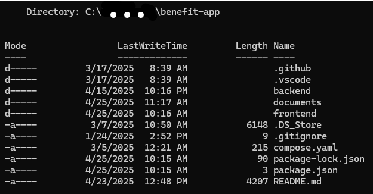
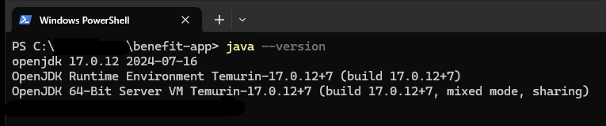
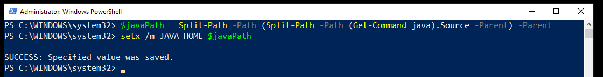

# Benefit-app backend

## 1. Setup for booting up Benefit-app's backend locally

In order to start Benefit-app's backend locally,
here are prerequisites that must
be installed and activated in your workstation. 


---

**a) Tools' list.**

Here is list of tools, that are required to be installed
for Windows workstations in order to activate Benefit-app:

* Docker (e.g Docker Desktop version 4.39.0 (184744) or newer).
* Git Bash (Git --> version 2.45.2 or newer and Bash --> version 5.2.26(1) or newer).
* Java (e.g. OPENJDK version 17 or newer).
* Visual Studio Code (version 1.98.2 or newer).

For Mac and Linux workstation, we will report all necessary tools
in more detail sometime in future (WIP).

---

**b) Quick setup.**
If you have all necessary tools installed,
you can try activate directly the backend via below commands
at your benefit-app directory root:

```sh
docker compose up -d
$javaPath = $javaPath = Split-Path -Path (Split-Path -Path (Get-Command java).Source -Parent) -Parent
setx /m JAVA_HOME $javaPath
cd .\backend
.\gradlew build
java -jar .\build\libs\backend-0.0.1-SNAPSHOT.jar
```

If you can't activate the backend via above command,
please read rest of document.

---

**c) Activate CLI tool (i.e. open the terminal).**

For following steps, you need to activate Command Line Interface -tool (CLI),
or open the terminal, in your workstation. CLI will be used for running database, 
docker, building application.

In your Windows workstation, you can use any CLI tools you like.
In our group, we used following CLIs in our project:

*Powershell

*Visual Studio Code's terminal

*Windows Terminal

---

**d) Activate PostgreSQL via Docker.**

///

*Note:* In the following instructions, `Drive:/path/to/benefit-app/backend`
is a placeholder. Replace `Drive:` with your actual drive letter (depending
your workstation).

*Example*:
- Placeholder: `Drive:/path/to/benefit-app/backend`
- Windows: `C:/path/to/benefit-app/backend`

///

Move to the benefit-app's directory.

```sh
cd Drive:/path/to/benefit-app
```

Image: The root directory of Benefit app.

In the benefit-app directory, you will activate
PostgreSQL via Docker. The PostgreSQL is configured
in the compose.yaml -file.


Image: The compose.yaml -file.

Note from above image! The INSERT_DB, INSERT_PASSWORD,
and INSERT_USER are just placeholder. You need to 
have the correct values for db, password and user
in PostgreSQL, give by Fisma ry.


Next, make sure you have the Docker
is installed in your workstation,
e.g. Docker Desktop. You can check
that have the current version of Docker
installed via command

```sh
docker --version
```


Image: A screenshot of Docker desktop with the benefit-app dockerized.

After all validations and checking,
you should able to active Postgresql
via docker compose's command

```sh
docker compose up -d
```

in the Drive:/path/to/benefit-app -directory.
Please note the last option `-d`, which
will run PostgreSQL's docker in background.
If you forgot write it, then you need to close
the CLI and reopen it again.

Alternatively, you can shut down docker via 
keybindings CTRL+C and run docker compose again.


Image: An example of successful output from docker compose up.

Additionally, you have to check that database accepts 
incoming queries. You can check database's query management
via command

```sh
docker exec -it INSERT_CONTAINER_NAME psql -U POSTGRES_USER POSTGRES_DB
```

Note that POSTGRES_USER and POSTGRES_DB are values from compose.yaml file. You need to ask Fisma ry for the values.

Meanwhile INSERT_CONTAINER_NAME is name for current container,
that is actively running benefit-app image.

For getting getting correct container name,
the easiest way to check is via command

```sh
docker ps
```
As example in our workstation, our container is named
benefit-app-postgres-1 , like in the image below:


Image: Result from command 'docker ps'.

Hence our command will be
```sh
docker exec -it benefit-app-postgres-1 psql -U POSTGRES_USER POSTGRES_DB
```
Once again, you need to ask values for POSTGRES_USER and POSTGRES_DB
from Fisma ry.

---

**e) Validate Java version in your workstation.**

After activating PostgreSQL's docker,
move to backend of benefit-app:

```sh
cd Drive:/path/to/benefit-app/backend
```

In backend directory, you need to build 
Java application of benefit-app.
In order to build any Java application
in your Windows workstation, make sure
that you have first installed Java language
from official Java website.

You can check the current version of your Java
via command

```sh
java --version
```

Image: Result from command 'java --version'.

Additionally, make sure that you have also
set JAVA_HOME to the correct Java Installation Path.

For example in Powershell, you can get the correct Java path
and configure into JAVA_HOME environment variable 
via commands:

```sh
$javaPath = Split-Path -Path (Split-Path -Path (Get-Command java).Source -Parent) -Parent
setx /m JAVA_HOME $javaPath
```


Image: Configuring JAVA_HOME environment in Powershell.

The first command's '(Get-Command java).Source' will give full path for java.exe.
The the double 'Split-Path -Path' will then give Java's full directory's path, such
as \Eclipse Adoptium\jdk-17.0.12.7-hotspot . The path will be tehn saved into javaPath -variable.

The second command will then configure JAVA_HOME to the correct path for installed Java
via javaPath -variable.


According Cameron McKenzie from TheServerSide: 
"JAVA_HOME is an operating system (OS) environment
variable which can optionally be set after either the
Java Development Kit (JDK) or the Java Runtime Environment (JRE)
is installed. The JAVA_HOME environment variable points
to the file system location where the JDK or JRE was installed.
This variable should be configured on all OS's that have a Java
installation, including Windows, Ubuntu, Linux, Mac and Android." 

\\\ Source: https://www.theserverside.com/definition/JAVA_HOME \\\

If you have not configured JAVA_HOME to actual location 
of where the JDK or JRE was installed, there is high 
propability that Benefit-app's java application
in backend will not run at all. Note that JAVA_HOME 
will **not** likely be automatically updated even after
installing Java in your computer.

Incorrect JAVA_HOME have caused at least one of our member
big headache for not able running Benefit-app's backend
at the beginning (the Java's error message were not 
helpful at all).

---

**f) Build Java application in the backend.**

After checking and validating both Java version and
JAVA_HOME variable's path, you need lastly check
build.gradle -file in the backend.

[IMAGE: build.gradle -file of Java language version]

Depending which version of Java you have installed
in your workstation, you must update code line 12
in build.gradle file of backend:

```sh

// benefit-app/backend/build.gradle
languageVersion = JavaLanguageVersion.of([INSERT_NUMBER])
```

Note that [INSERT_NUMBER] is a placeholder, which
you add the version number of your installed Java.

In our group, couple of use had differ versions of
Java in our computers. Some of us had Java version 17,
therefore `languageVersion = JavaLanguageVersion.of(17)`,
while some had Java version 23, hence
`languageVersion = JavaLanguageVersion.of(23)`.

Note that default Java version is 17.

Incorrect Java version number in the code line
will cause errors in building phase.

///

When you checked and set the correct Java version number
in the codeline 12 inside build.grade -file, you can
start building the Java application in the CLI
via following Gradle command

```sh
./gradlew build
```

If build is a failure, you need still fix some
configurations in the backend (e.g. review your tools,
Java language, etc.). If build is a success,
continue next step.

**g) Run Java application in the backend.**

After successful build, move to following path

```sh
Drive:/path/to/benefit-app/backend/build/libs 
```

i.e. backend's builded libaries.

Here, you should have jar files builded in the current
directory. Either check in Visual Studio Code the directory
or in CLI via `ls` or `dir` -commands

To run the java application of Benefit app,
activate the correct jar file via command

```sh
java -jar .\backend-0.0.1-SNAPSHOT.jar
```

Then you should see Spring logo, Spring Boot version and other lines 
printing on your CLI.

To validate if your jar is successfully running,
the last line should be equivalent to following line
```sh

"INFO 22516 --- [backend] [           main] ''.'''''.backend.BackendApplication      
: Started BackendApplication in 8.051 seconds (process running for 8.908)"

```

This will indicate that you have now the Benefit-app's backend 
successfully up and running.

If don't get the last line, it is indication there is
error in the backend.

Please read frontend.md manual (https://github.com/fisma-benefit-app/benefit-app/blob/dev/documents/frontend_manual.md) 
for instruction of activating Benefit-app's frontend.
