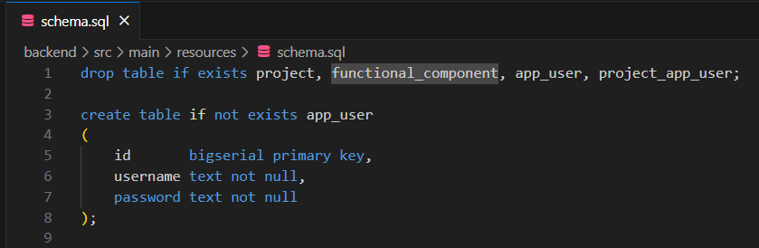

# Authentication and Authorization Guide

This guide explains the login functionality of the Benefit app. It introduces key files, code snippets, and logical structure behind the authentication system.

## A) User Accounts Database

The user account database is defined in the SQL files located in `benefit-app/backend/src/main/resources/`.

- `schema.sql` defines the structure of the app_user table. Example (line 3):

```sql
create table if not exists app_user (
...
);
```



Image: Creating app_user table in schema.sql.

- `data.sql` provides initial seed data for the app_user table. Example (line 6):

```sql
insert into app_user (id, username, password) values (...);
```

![app user table in the data sql-file]../img/images_for_guides/data_sql_app_user_table.png)

## B) Handling User Accounts in Java

The backend logic for user accounts is implemented in: `benefit-app/backend/src/main/java/fi/fisma/backend/appuser/`

Key classes include:

### AppUser.java

Defines the AppUser entity with three essential fields:

- id
- username
- password


Image: `AppUser.java` entity.

### AppUserController.java

Provides REST endpoints for managing users.

- Update password
- Delete user


Image: `AppUserController.java`.

### AppUserRepository.java

Extends JpaRepository and defines query methods.

- Example: findByUsername()


Image: `AppUserRepository.java.`

## C) Authentication Flow

This section describes how authentication tokens are generated, validated, and stored during a user’s login session.

### Login request

Login requests use Basic authentication. After successful authentication, a JWT is generated and returned.

The frontend (`api/authorization.ts`)

- encodes username + password as `Basic <base64(username:password)>` in the Authorization header
- sends a `POST /token` request to the backend.

The backend (`security/TokenController.java`)

- intercepts the request using Spring Security and extracts the `Authorization: Basic ...` header
- authenticates the user against `UserDetailsService` and populates the Authentication object with user details (see [Authentication process](#authentication-process) for more information)
- generates a JWT (see [Token generation](#token-generation) for more information).

Finally

- frontend receives a response with an `Authorization: Bearer <jwt>` header
- because of `ACCESS_CONTROL_EXPOSE_HEADERS`, the browser is allowed to read the Authorization header in JavaScript
- on subsequent requests, the frontend includes the JWT in the header and backend validates it.

### Authentication process

Credentials are checked against the app_user table in `UserDetailsService` using the `loadUserByUsername` method and against the storedHashedPassword in `SecurityConfig` using `DaoAuthenticationProvider`.

- AppUserRepository queries the app_user table for a row with the provided username.
- DaoAuthenticationProvider uses BCrypt to check whether rawPassword matches the storedHashedPassword.
- If username and password match, Spring builds an Authentication object with the AppUserDetails (id, username, password, authorities\*) provided.
- The object is injected into TokenController, where TokenService is called for token generation.

\* All authenticated users are given the authority ROLE_USER.

Exceptions (401 UNAUTHORIZED):

- If no row is found matching the provided username, UsernameNotFoundException is thrown and login fails.
- If the provided rawPassword does not match the storedHashedPassword, BadCredentialsException is thrown and login fails.

### Token generation

JWT tokens are used. They're generated after authentication succeeds and an Authentication object is passed to TokenService.

Claims:

- User identity (username) is stored in the `subject` claim.
- User roles are stored in the `scope` claim.
- Tokens are valid for 24 hours. Expiry is stored in the `expiresAt` claim.

Example payload:

```json
{
  "iss": "self",
  "sub": "alice",
  "scope": "ROLE_USER",
  "iat": 1699999999,
  "exp": 1700086399
}
```

JWTs are encoded with a private RSA key using the JwtEncoder bean in `SecurityConfig`. Finally, a compact serialized JWT string is returned for storage on the client.

### Session management

Tokens are stored in the client-side Authorization header. After authentication succeeds, subsequent requests are intercepted by Spring Security’s `BearerTokenAuthenticationFilter` using `oauth2ResourceServer`.

The JwtDecoder bean verifies that

- the signature matches the public key
- the token hasn’t expired
- the claims are valid.

If everything matches, Spring builds an Authentication object that controllers can then use to access the logged-in user.

### Logout / token revocation

When the user logs out, the frontend sends a `POST /auth/logout` request to the backend with the JWT in the `Authorization` header. The backend extracts the token’s unique ID (`jti`) and expiration time, and adds it to an in-memory blacklist using `TokenBlacklistService`.

After logout:

- The token is immediately invalidated on the backend, even if it has not expired.
- Any subsequent requests using the same JWT will be rejected with a `401 Unauthorized` response.
- The blacklist is periodically cleaned to remove expired tokens.

**Session management:**

- Tokens are still stored in client-side sessionStorage and React state.
- After logout, the frontend removes the token from storage and resets authentication state.
- The backend checks the blacklist for every incoming JWT. If the token is blacklisted, authentication fails.

**Note:**  
This approach provides immediate logout and token invalidation, even though JWTs are stateless by default. The backend remains stateless except for the blacklist, which is kept in memory and cleaned regularly.
