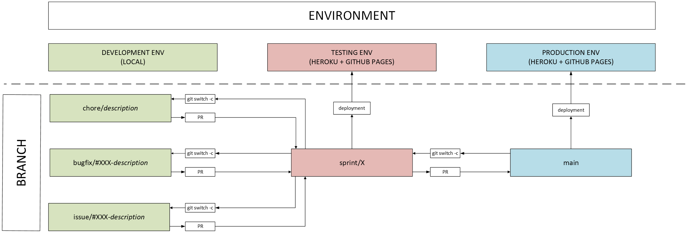

# Branching strategy guide

This document further explains the branching strategy used in Benefit application's development and CI/CD pipeline.

The goal of the strategy is to simplify development work when multiple developers are working on the same repository, avoid merge conflicts, and proactively prevent deployment-related issues. The following strategy is also open-source contribution friendly. Branches named according to predefined schemas also tie development work more closely to project management, make branches more understandable to other developers, and eliminate the need to ponder what the branch should be named.

## Branching strategy flow

Here, the branching strategy has been visualized as an image.

<details>
<summary><b>Click here to view the branching strategy as an image</b></summary>

</details>

## Implementing the strategy

The strategy is implemented as outlined below:

1. We use trunk-based development. That means that all merges are done directly to `main`; there are no sprint-specific branches.

2. Developers create local development branches from `main` branch using, for example, the `git switch -c` command. The naming schema for development branches depends on the type of development:
   - for feature issues, the naming schema is `issue/#XXX-description`
   - for bugfixes, the naming schema is `bugfix/#XXX-description`
   - for small chores, the naming schema is `chore/description`

   Here “#XXX” is the issue/bugfix number (e.g., #219 in GitHub project management), and “description” is the issue title (e.g., “Clean up GitHub documentation”). So the branch names could be
   - `issue/#219-clean-up-github-documentation`
   - `bugfix/#220-functional-component-shows-wrong-title`
   - `chore/fix-typos-in-documentation`

   This way, the branches we open PRs from are clearly linked to a specific issue. Each issue and bugfix on the project board should have its own dedicated branch. Chores are small changes that don't have their own issues due to the minimal effort and impact they have.

3. When a development branch is ready to be merged into `main` branch, it is pushed to GitHub as a new branch, and a pull request is opened for review by another developer. When each development branch contains changes related to only one issue, it’s easier to keep track of what has been done. It also makes the reviewer’s job easier, as pull requests remain reasonably sized and focused on a single issue.

   ```
   !! While coding, if you notice that something not related to the issue you are currently working on could be changed, don't implement it in the same pull request!
   !! Instead, create a separate issue and open a separate PR for it. This way our PRs stay clean and compact and all our work gets documented in project management.

   !! If you notice a bug that needs to be fixed, create a bug issue for it and fix it in a separate PR.
   ```

4. After the pull request is approved and automated checks pass, the development branch can be merged into `main` branch. The development branch is automatically deleted from GitHub.

5. Merging into `main` triggers automatic deployment to testing environments in Heroku and GitHub Pages.

6. Select a new issue to work on and create a new development branch from `main`.

## Notes

A few notes regarding the strategy:

1. The separate testing environment can be used to test features in an environment separate from production. See the [deployment guide](./deployment_guide.md) on how to deploy to the testing and production environments.

2. Since the `main` branch is continuously updated with changes made by developers and merged via pull requests, it’s important to regularly pull the latest version of `main` branch into the local environment before creating a new development branch.

3. The strategy is not final – it will be adjusted as needed based on experiences gained during development. However, it provides a solid foundation for starting systematic development work involving multiple developers working simultaneously.
