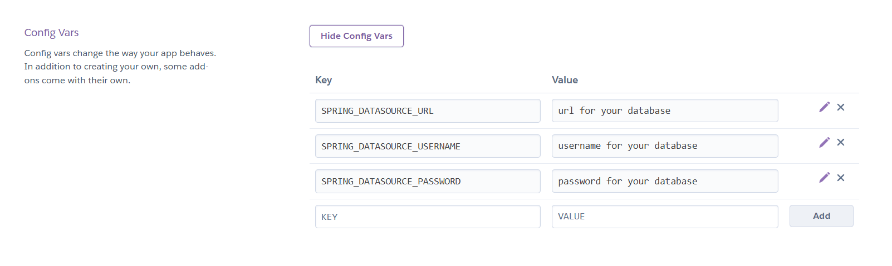
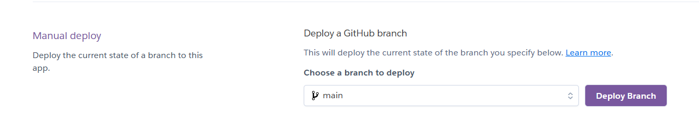

# Backend Heroku Deployment

https://dashboard.heroku.com/apps/fisma-benefit-app

Backend urls look like this: https://fisma-benefit-app-f46bf93af467.herokuapp.com/

Logs:

```sh
heroku logs --tail --app fisma-benefit-app
```

## Deployment procedure

1. Backup the database before deployment.

2. Copy changes to repo. Currently we have to commit changes to repo https://github.com/loota/fisma-backend-alt by manually copying them from this main repo. This because Heroku wants the backend in the root directory.

3. Go to heroku and press _deploy_.


---

## How the Heroku deployment was created

### Requirements

- Heroku account (credit card needed for account)
- Email address
- Running database and its credentials (url, username and password)

## 1. Repository clone

### 1. Clone the repository

Clone the backend folder from the repository at https://github.com/loota/fisma-backend-alt.

### 2. Edit build.gradle file

Find the file build.gradle from the root of the file. In the following lines of the file, make sure the version is 21:

```java
java {
    toolchain {
        languageVersion = JavaLanguageVersion.of(21)
    }
}
```

## 2. Heroku deployment

### 1. Create app

Navigate to your dashboard and click New -> Create new app.
Then enter your app's name and select Europe. Click Create app.


### 2. Configure app settings

Navigate to settings.


Click on Reveal Config Vars.


Create Key-value pairs for the credentials of your database (username, password and url), where the key is one of the following datasource variables and the value is the actual value for your database:



### 3. Configure GitHub-repository

Navigate to Deploy.


Select GitHub as the deployment method.
Enter your repository name in the field and click search:


If successful, you should see the app connecting to github:


Select the correct branch and click Deploy Branch.



### 4. Updating the backend

After commiting changes to the appopriate github repository, go back to heroku and press _deploy_.
the backend resides at https://github.com/loota/fisma-backend-alt

Currently we have to commit changes to that backend repo by manually copying them from this main repo.


### 5. Set up Heroku CLI

Install heroku CLI from https://devcenter.heroku.com/articles/heroku-cli

In your console, enter

```sh
heroku login
```

Accept the login prompt in your browser:


To view detailed logs from your app, enter in your console:

```sh
heroku logs --tail --app fisma-benefit-app
```

Where `fisma-benefit-app` is the name you entered when creating the app.

## Why backend credentials are in separate repository.

Backend credentials are sperated from the public benefit-app
repository to the private backend-credentials repository.

This is due Heroku service can't read credentials from benefit-app repository.

The public benefit-app repository has currently a complex structure, which
makes the reading the correct credentials a difficult task for Heroku service.

Thus, we created separate private backend-credentials repository
in order Heroku able to read correct credentials faster.

Note that in Heroku, we have only the code.

# Frontend Github Pages Deployment

https://github.com/fisma-benefit-app/benefit-app/settings/pages

### Build log

See Github Actions https://github.com/fisma-benefit-app/benefit-app/actions
The rows with comment "pages build and deployment"

## 1. Configuration

### 1. vite.config.js

```ts
export default defineConfig({
  base: "/benefit-app/",
  plugins: [
    react(),
    tailwindcss(),
  ],
})
```

The **base** property specifies the base public path where the app is be served from. For Github Pages this must be set to the project repository name.

### 2. package.json

The frontend uses the gh-pages npm package which is used to deploy the application to Github Pages from command line.

```ts
"devDependencies": {
    "gh-pages": "^6.3.0",
}
```

Deployment scripts:

```ts
 "scripts": {
    "predeploy": "npm run build",
    "deploy": "gh-pages -d dist"
  },
```

- predeploy builds the project into the dist folder.

- deploy publishes the contents of dist to the gh-pages branch.

## 2. Deployment

Application is built locally, so you need to run _npm install_ first

Note: Before deploying you should have the environment variable **VITE_API_URL** in the file

frontend/.env.production

and its value should match the backend server address. When frontend is built and deployed, Vite substitutes environment variable values in the code. Here you need to have the backend url.

.env.production:

```sh
VITE_API_URL = https://fisma-benefit-app-XXXXXXXXX.herokuapp.com
```

Frontend can be deployed to Github pages by running following command while in the frontend project folder:

```sh
npm run deploy
```

## 3. Settings in GitHub

You can view and check GitHub Pages deployment changes in github repository **settings** and the **pages** section


